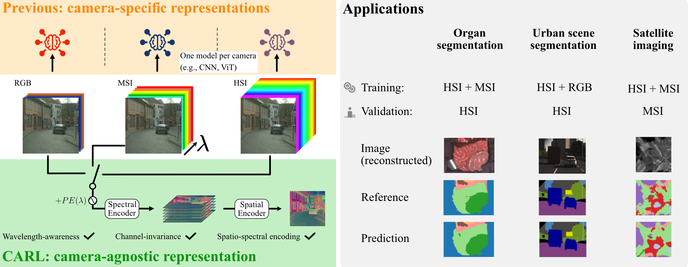

# CARL

[](https://arxiv.org/abs/2504.19223)
[](https://iclr.cc/virtual/2026/poster/10009281)

### Camera-Agnostic Representation Learning for Spectral Image Analysis

✔ Sensor-agnostic   
✔ Self-supervised pretraining  
✔ Classification  
✔ Segmentation  
✔ Satellite imaging SSL-checkpoint  

### 📄 Publication:
Accepted at **ICLR 2026**  

**Authors:** Alexander Baumann, Leonardo Ayala, Silvia Seidlitz, Jan Sellner,
Alexander Studier-Fischer, Berkin Özdemir, Lena Maier-Hein*, Slobodan Ilic*

**Paper:** https://arxiv.org/abs/2504.19223  



---

## Overview

CARL is a camera-agnostic feature encoder for spectral images. It supports downstream tasks such as **classification**, **segmentation**, and **regression**, and provides a **self-supervised checkpoint** for rapid transfer learning.

This repository contains model code, dataset loaders, and training implementations using **PyTorch Lightning**.

## Contents
- [Installation](#installation)
- [Quick start](#quick-start)
  - [Supervised training (classification / segmentation)](#supervised-training-classification--segmentation)
  - [Self-supervised training](#self-supervised-training)
- [Data format](#data-format)
- [Project structure (high level)](#project-structure-high-level)
- [License and third-party code](#license-and-third-party-code)
- [Citation](#citation)

## Installation

Optional: create an isolated virtual environment:

```bash
python -m venv .venv
source .venv/bin/activate
```

Install pytorch with CUDA support (adjust the CUDA version in the URL as needed), then install the required packages:

```bash
pip install torch --index-url https://download.pytorch.org/whl/cuxxx
pip install -r requirements.txt
pip install geobench --no-deps
```

Optional: compile deformable attention CUDA kernels (needed for ViT-Adapter):

```bash
cd segmentation_heads/upernet/utils/ops
python setup.py build install
```

## Quick start

### Supervised training (classification / segmentation)

The repository supports supervised training for image classification and segmentation using CARL.

- **Spectral encoder (CARL):**
  - either randomly initialize, or
  - load the self-supervised CARL checkpoint (pretrained on remote sensing data)

- **Spatial encoder:**
  Choose among pretrained ViT/EVA models (via `timm`). Examples include **DINOv2, DINOv3, Perception Encoder, and EVA-02**.

- **Segmentation head (for semantic segmentation):**
  - Linear head
  - ViT-Adapter + UperNet
  - ViT-Adapter + Mask2Former
  - Swin Transformer + Mask2Former

1) Download the remote sensing self-supervised checkpoint (optional):

```bash
wget -O carl_ssl_checkpoint.ckpt https://zenodo.org/records/18671944/files/ssl_checkpoint_carl.ckpt 
```

2) Pick an example configuration in `configs/` or create your own.

3) Train:

Segmentation:
```bash
python main_seg.py --config configs/config_seg.yaml
```

Classification:
```bash
python main_cls.py --config configs/config_cls.yaml
```

Tip: for a minimal model load + feature extraction example, see `example.py`.

### Self-supervised training

To create your own self-supervised checkpoint on your custom data and model, prepare your datasets and configuration, then run:

```bash
python main_ssl.py --config configs/config_ssl.yaml
```

## Model performance
The performance of CARL-SSL was evaluated via linear probing across 11 diverse datasets and compared against 6 state-of-the-art baselines. As shown in the table below, CARL-SSL demonstrates robust generalization capabilities across different sensors, achieving an average rank of 1.6.

|Dataset|m-ben|m-eurosat|m-forestnet|m-crop-type|SegMunich|Wuhan|LoveDA Rural|WHU-OHS|Avg. rank (vs. 6 models)|
|-|:-:|:-:|:-:|:-:|:-:|:-:|:-:|:-:|:-:|
|CARL|69.0|84.4|47.0|26.5|38.9|21.5|21.7|21.7|1.6|

## Data format

- Images: tensors of shape `(B, C, H, W)` where `C` is the spectral dimension.
- Wavelengths: tensors of shape `(B, C)` expressed in **micrometers**.
- Inputs are expected to be mean/std normalized (either global training-set stats or per-image normalization).

Dataset classes live in `carl/data`. The dataset class must have the same name as the corresponding Python file. In the config file, it must look like this:

```yaml
# ...example snippet...
train_dataset:
  name: MyDatasetClass
  # ...dataset args...
```

For supervised training, [GeoBench](https://github.com/ServiceNow/geo-bench) dataset wrappers have been implemented for classification and segmentation.

For self-supervised pretraining, dataset classes for [BigEarthNet](https://bigearth.net/), [SpectralEarth](https://github.com/AABNassim/spectral_earth), and [HySpecNet-11k](https://hyspecnet.rsim.berlin/) have been integrated.
In particular, the training data comes from distinct sensors with different channel counts.
To accommodate this, a custom dataloader is utilized, which can be found in `carl/data/dataloader.py`.

## Project structure (high level)

- `carl/` — datasets, model, modules and trainers
- `segmentation_heads/` — segmentation heads such as ViT-Adapter, UperNet, Mask2Former
- `configs/` — example YAML configs for training and evaluation
- `example.py` — minimal script showing model loading and feature extraction
- `main_*.py` — training/evaluation entry points (Lightning)

## License and third-party code

Please review the root `LICENSE` file for full license terms. Third-party code is licensed under `LICENSE-THIRD-PARTY` or Apache 2.0 as in `LICENSE`.

## Citation

If you use CARL, please cite:

```bibtex
@inproceedings{
baumann2026carl,
title={{CARL}: Camera-Agnostic Representation Learning for Spectral Image Analysis},
author={Alexander Baumann and Leonardo Ayala and Silvia Seidlitz and Jan Sellner and Alexander Studier-Fischer and Berkin {\"O}zdemir and Lena Maier-hein and Slobodan Ilic},
booktitle={The Fourteenth International Conference on Learning Representations},
year={2026},
url={https://openreview.net/forum?id=TpbhS1yfz0}
}
```

## Funding

This project has received funding from the European Research Council (ERC) under the European Union’s Horizon 2020 research and innovation programme (grant agreement No. 101002198).

